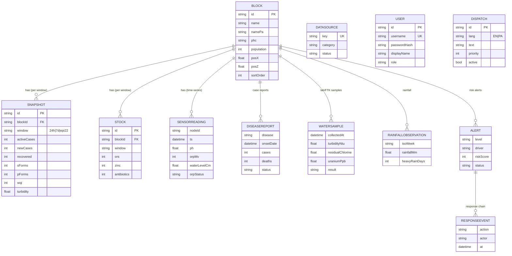

# NEERVANA — Database

NEERVANA runs on **PostgreSQL (Neon)** accessed through **Prisma 7** from a
layered Express 5 backend (routes → controllers → services → repositories →
domain). This document is the source of truth for the data model.

> **Data note:** the rows currently in this database are the **synthetic
> demonstration seed** (see [`DATASET.md`](../DATASET.md)). The schema is real
> and production-shaped; the *contents* are labelled demo data.

## Stack
| Layer | Choice |
|---|---|
| Engine | PostgreSQL 16 (Neon, serverless) |
| ORM | Prisma 7 — `prisma-client` generator + `@prisma/adapter-pg` + `pg` |
| Connection | pooled `DATABASE_URL` (`-pooler` host) in Vercel env; direct URL for migrations |
| Auth data | JWT + bcrypt password hashes (users table) |
| Seed | `server/src/db/seed.ts` loads `server/src/domain/seedData.ts` |
| Schema | [`prisma/schema.prisma`](../prisma/schema.prisma) |

## Entity–relationship model


## Tables (12)

> **Honesty banner:** only 6 tables are populated today — 5 with the labelled
> **synthetic-demo** seed (`blocks`, `snapshots`, `stock`, `dispatches`, `users`)
> and `sensor_readings` with the **synthetic-simulated** stream. The other 6 are
> the **data model for planned feeds/features** and are **empty** until real data
> or the feature lands (see `DATASET.md` DATA GAPS and `DATA_ARCHITECTURE.md`).

| Table (`@@map`) | Purpose | Holds today |
|---|---|---|
| `blocks` | 6 Patiala admin blocks | ✅ synthetic-demo |
| `snapshots` | IDSP + WQ snapshot per block per window (`24h/7d/epi22`) | ✅ synthetic-demo |
| `stock` | PHC essential-medicine buffer (%) | ✅ synthetic-demo |
| `dispatches` | Bilingual ticker messages | ✅ synthetic-demo |
| `users` | Dashboard operators (JWT) | ✅ seeded (`nodal.officer`) |
| `sensor_readings` | Field sensor time-series (pH/ORP/temp/level) per node | ✅ synthetic-simulated (CSV) |
| `rainfall_observations` | Weekly/daily rainfall (NASA POWER / IMD) | ⚪ real data **available**, not yet loaded |
| `disease_reports` | IDSP/IHIP/RTI case line-list | ⚪ **empty** — pending feed/RTI |
| `water_samples` | WQMIS/DWSS/FTK/CGWB samples w/ collection date | ⚪ **empty** — pending feed/RTI |
| `alerts` | Rule-based risk alerts | ⚪ **empty** — feature pending |
| `response_events` | Alert→ack→assign→act→verify→close audit chain | ⚪ **empty** — feature pending |
| `data_sources` | Integration source registry + status | ⚪ **empty** — mirrors `DATA_ARCHITECTURE.md` |

`window` ∈ `{ '24h', '7d', 'epi22' }` (rolling 24 h, 7 days, Epi-Week 22).

## API surface (read paths)
- `GET /api/blocks` → blocks with nested `snapshots` + `stock` (public).
- `GET /api/dispatches` → `{ EN: string[], PA: string[] }` (public).
- `POST /api/auth/login` → JWT (users table).
- `GET /api/health` → liveness.

## Local / ops
```bash
# generate client + run migrations
npx prisma migrate deploy
# seed (idempotent) the demonstration dataset
npm --prefix server run seed
```
Production DB + `JWT_SECRET` live in Vercel env vars (pooled connection). The
Express app is bundled to `api/index.js` for the Vercel function — see
[`HANDOFF.md`](../HANDOFF.md).

## Roadmap
The feed tables (`disease_reports`, `water_samples`, `rainfall_observations`,
`data_sources`) and the response-workflow tables (`alerts`, `response_events`)
are now **defined in the schema but not yet migrated to the live DB, populated,
or wired to the UI** — the data model is ready; ingestion + features are the
build. See [`docs/DATA_ARCHITECTURE.md`](DATA_ARCHITECTURE.md) for per-source
integration status.
