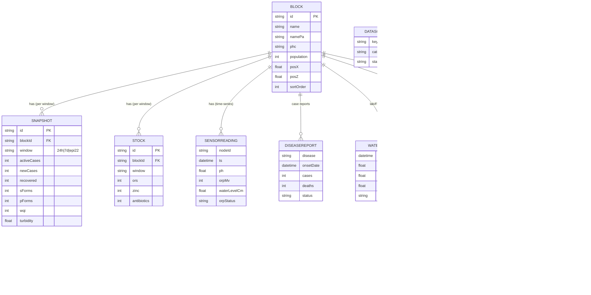

# NEERVANA — Database

NEERVANA runs on **PostgreSQL (Neon)** accessed through **Prisma 7** from a
layered Express 5 backend (routes → controllers → services → repositories →
domain). This document is the source of truth for the data model.

> **Data note:** the rows currently in this database are the **synthetic
> demonstration seed** (see [`DATASET.md`](../DATASET.md)). The schema is real
> and production-shaped; the *contents* are labelled demo data.

## Stack
| Layer | Choice |
|---|---|
| Engine | PostgreSQL 16 (Neon, serverless) |
| ORM | Prisma 7 — `prisma-client` generator + `@prisma/adapter-pg` + `pg` |
| Connection | pooled `DATABASE_URL` (`-pooler` host) in Vercel env; direct URL for migrations |
| Auth data | JWT + bcrypt password hashes (users table) |
| Seed | `server/src/db/seed.ts` loads `server/src/domain/seedData.ts` |
| Schema | [`prisma/schema.prisma`](../prisma/schema.prisma) |

## Entity–relationship model


## Tables (12)

> **Honesty banner:** all 12 tables now have seed fixtures, but **provenance is
> mixed and labelled per row** — never present it uniformly as measured govt data:
> `blocks/snapshots/stock/dispatches/users` = **synthetic-demo**; `sensor_readings`
> = **synthetic-simulated**; `rainfall_observations` + `disease_reports` = **real**
> (NASA POWER / Tribune-sourced); `water_samples` = 1 real + 1 CGWB reference;
> `data_sources` = factual registry; `alerts` + `response_events` = **rule-based
> demo**. Fixtures live in `data/seed/` (see below). The remaining granular feeds
> are still DATA GAPs (`DATASET.md` §3).

| Table (`@@map`) | Purpose | Holds today |
|---|---|---|
| `blocks` | 6 Patiala admin blocks | ✅ synthetic-demo |
| `snapshots` | IDSP + WQ snapshot per block per window (`24h/7d/epi22`) | ✅ synthetic-demo |
| `stock` | PHC essential-medicine buffer (%) | ✅ synthetic-demo |
| `dispatches` | Bilingual ticker messages | ✅ synthetic-demo |
| `users` | Dashboard operators (JWT) | ✅ seeded (`nodal.officer`) |
| `sensor_readings` | Field sensor time-series (pH/ORP/temp/level) per node | ✅ synthetic-simulated (CSV) |
| `rainfall_observations` | Weekly/daily rainfall (NASA POWER / IMD) | ✅ **real** — 27 wk NASA POWER (seed) |
| `disease_reports` | IDSP/IHIP/RTI case line-list | ✅ **real** — 3 Tribune-sourced events (seed) |
| `water_samples` | WQMIS/DWSS/FTK/CGWB samples w/ collection date | 🟡 seed: 1 real fail + 1 CGWB reference; rest = gap |
| `alerts` | Rule-based risk alerts | ✅ 1 alert seeded **open**; advanced live via API |
| `response_events` | Alert→ack→assign→act→verify→close audit chain | ✅ **written live** by `POST /api/alerts/:id/advance` |
| `data_sources` | Integration source registry + status | ✅ registry — 6 rows (seed) |

`window` ∈ `{ '24h', '7d', 'epi22' }` (rolling 24 h, 7 days, Epi-Week 22).

## API surface
- `GET /api/blocks` → blocks with nested `snapshots` + `stock` (public).
- `GET /api/dispatches` → `{ EN: string[], PA: string[] }` (public).
- `GET /api/alerts` → active alerts with their `events` response chain (public).
- `POST /api/alerts/:id/advance` → `{ action, note? }`; appends a `response_event`
  (actor = signed-in officer) and advances the alert status. **Auth required.**
  Rejects out-of-order actions (409) and unauthenticated calls (401).
- `POST /api/auth/login` → JWT (users table).
- `GET /api/health` → liveness.

## Local / ops
```bash
# generate client + run migrations
npx prisma migrate deploy
# seed (idempotent) the demonstration dataset
npm --prefix server run seed
```
Production DB + `JWT_SECRET` live in Vercel env vars (pooled connection). The
Express app is bundled to `api/index.js` for the Vercel function — see
[`HANDOFF.md`](../HANDOFF.md).

## Seed data
Repo fixtures (provenance-labelled per row):
- `data/seed/reference_data.json` — data_sources (6), disease_reports (3, real),
  water_samples (2), alerts (1) + response_events (5, demo).
- `data/seed/rainfall_observations.csv` — 27 real weekly rows (NASA POWER).
- `data/neervana_sensor_simulated.csv` — 2,016 simulated sensor rows.

Apply the schema + load fixtures (locally, or for production with a **rotated**
`DATABASE_URL` / `DIRECT_URL`):
```bash
npx prisma migrate deploy               # applies migrations incl. 20260909_add_env_alerts_sensors (the 6 new tables)
npx prisma generate
npm run db:seed                         # base: blocks / snapshots / stock / dispatches / users
npx tsx server/src/db/seedExtended.ts   # sources, disease, rainfall, sensors, + one OPEN alert
```

> **Production status.** The alert accountability chain and rainfall are wired
> into the dashboard and **persist to the database** via `POST /api/alerts/:id/advance`
> whenever the API can reach the 12-table schema (verified end-to-end locally).
> The **live Neon DB must still be migrated** (command above) before it persists
> in prod; until then the alert chain falls back to a local demo automatically.
> ⚠️ **Rotate the Neon password first** (it was exposed in chat) and update the
> Vercel env, then run the migration. See
> [`docs/DATA_ARCHITECTURE.md`](DATA_ARCHITECTURE.md).
