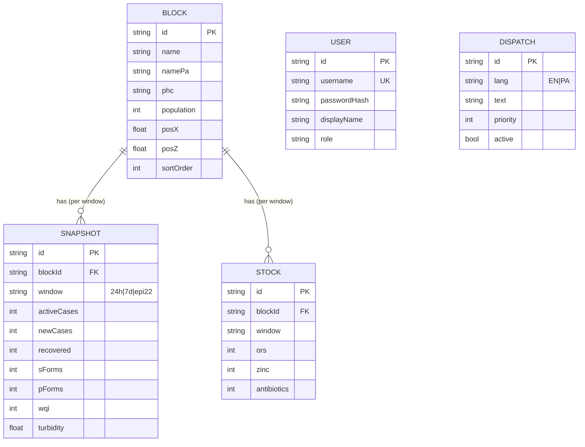

# NEERVANA — Database

NEERVANA runs on **PostgreSQL (Neon)** accessed through **Prisma 7** from a
layered Express 5 backend (routes → controllers → services → repositories →
domain). This document is the source of truth for the data model.

> **Data note:** the rows currently in this database are the **synthetic
> demonstration seed** (see [`DATASET.md`](../DATASET.md)). The schema is real
> and production-shaped; the *contents* are labelled demo data.

## Stack
| Layer | Choice |
|---|---|
| Engine | PostgreSQL 16 (Neon, serverless) |
| ORM | Prisma 7 — `prisma-client` generator + `@prisma/adapter-pg` + `pg` |
| Connection | pooled `DATABASE_URL` (`-pooler` host) in Vercel env; direct URL for migrations |
| Auth data | JWT + bcrypt password hashes (users table) |
| Seed | `server/src/db/seed.ts` loads `server/src/domain/seedData.ts` |
| Schema | [`prisma/schema.prisma`](../prisma/schema.prisma) |

## Entity–relationship model


## Tables
| Table (`@@map`) | Purpose | Key columns | Constraints |
|---|---|---|---|
| `blocks` | Revenue/admin blocks of Patiala district | `id`, `name`/`namePa`, `phc`, `population`, `posX/posZ` | PK `id` |
| `snapshots` | IDSP + water-quality snapshot per block per window | `activeCases`, `newCases`, `recovered`, `sForms`, `pForms`, `wqi`, `turbidity` | unique `(blockId, window)`; FK→blocks cascade |
| `stock` | PHC essential-medicine buffer (% ) per block per window | `ors`, `zinc`, `antibiotics` | unique `(blockId, window)`; FK→blocks cascade |
| `users` | Dashboard operators (e.g. District Nodal Officer) | `username` (unique), `passwordHash`, `role` | PK `id` |
| `dispatches` | Official ticker messages (bilingual) | `lang`, `text`, `priority`, `active` | index `(lang, active)` |

`window` ∈ `{ '24h', '7d', 'epi22' }` (rolling 24 h, 7 days, Epi-Week 22).

## API surface (read paths)
- `GET /api/blocks` → blocks with nested `snapshots` + `stock` (public).
- `GET /api/dispatches` → `{ EN: string[], PA: string[] }` (public).
- `POST /api/auth/login` → JWT (users table).
- `GET /api/health` → liveness.

## Local / ops
```bash
# generate client + run migrations
npx prisma migrate deploy
# seed (idempotent) the demonstration dataset
npm --prefix server run seed
```
Production DB + `JWT_SECRET` live in Vercel env vars (pooled connection). The
Express app is bundled to `api/index.js` for the Vercel function — see
[`HANDOFF.md`](../HANDOFF.md).

## Roadmap (not yet in the schema)
External data feeds (IDSP, WQMIS, CGWB, IMD, field sensors) and the
alert→acknowledge→act→close workflow are **planned**, not implemented — see
[`docs/DATA_ARCHITECTURE.md`](DATA_ARCHITECTURE.md) for their integration status.
