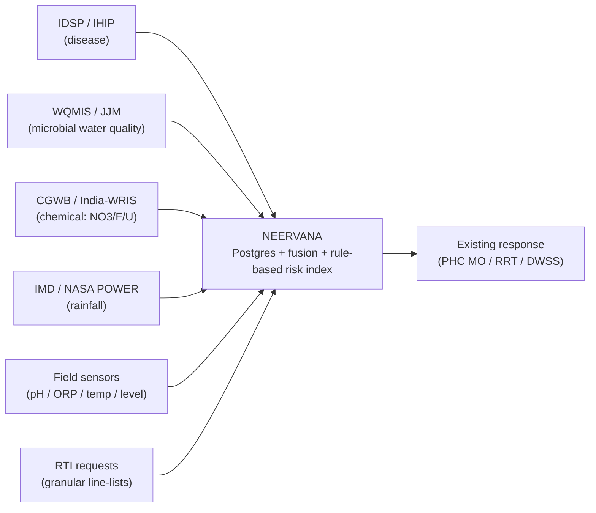

# NEERVANA — Data architecture & source registry

NEERVANA is designed as a **fusion / decision-support layer**, not a parallel
data silo: it pulls from the water- and health-data systems that already exist,
combines them, and routes an alert into the **existing** government response
chain. This document is the honest registry of those sources and **exactly how
far each one is integrated today.**

> **Status as of 2026-09.** The live app serves **demonstration data from its own
> PostgreSQL database** (see [`DATABASE.md`](DATABASE.md) / [`DATASET.md`](../DATASET.md)).
> Public feeds (IMD/NASA rainfall, CGWB) have been *retrieved and validated* but
> are **not yet wired into the live app**. Government feeds that need an
> agreement (IDSP line-list, WQMIS) are **pending an MoU**. Field sensors are
> **simulated** — no hardware is deployed. Nothing below is a claim of a live
> government data connection that does not exist.

## Fusion flow

## Source registry (honest integration status)
Legend — **Connected**: feeding the app now · **Available**: public, retrieved, not yet wired ·
**Pending-MoU**: needs a data-sharing agreement · **Simulated**: mock data, no hardware ·
**Manual**: obtained by request (e.g. RTI), not an automated feed.

| Source | Provides | Access method | Status |
|---|---|---|---|
| NEERVANA PostgreSQL (own DB) | blocks, snapshots, stock, dispatches | Prisma / internal | **Connected** — *data is `synthetic-demo`* |
| IMD / **NASA POWER** | rainfall (daily → weekly) | public API | **Available** — pulled Apr–Sep 2025 for Patiala; not yet in live app |
| **CGWB / India-WRIS** | groundwater chemistry (nitrate, fluoride, uranium) | public reports / portal | **Available** — reference/context only |
| **IDSP / IHIP** | outbreak reports; weekly aggregates | public weekly PDFs (aggregate); portal (granular) | **Pending-MoU** — aggregates public, block line-list needs agreement |
| **WQMIS / JJM** | turbidity, residual chlorine, FTK positives | state portal (gated) | **Pending-MoU** — portal-gated |
| Field IoT sensors | pH, ORP, temperature, water level | MQTT/HTTP from devices | **Simulated** — see `data/neervana_sensor_simulated.csv`; hardware not deployed |
| **RTI** (District Health Office / DWSS) | granular case line-lists, dated water samples | formal RTI request | **Manual** — fallback for gated data, not an automated feed |

## What this buys the government reviewer
- A **single fused view** across disease + water + rainfall + (future) sensors, instead of four disconnected portals.
- A **transparent rule-based risk index** (not a black-box "AI prediction") whose inputs are all visible — see the honesty discussion in `DATASET.md`.
- A migration path: **switch a source from "Available/Pending-MoU" to "Connected"** as public APIs are wired and MoUs are signed — no re-architecture.

## Honest gaps (do not overstate in a pitch)
- No live IDSP/WQMIS/RTI feed is connected yet; those are **requests/agreements in progress**, not running integrations.
- The predictive claim is **not validated** (n=1 outbreak); current output is a heuristic index, not a trained model.
- See the DATA GAP / RTI list in [`DATASET.md`](../DATASET.md) §3.
